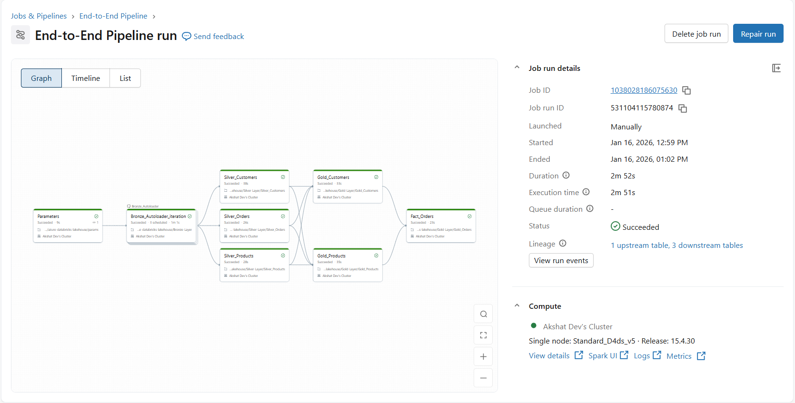
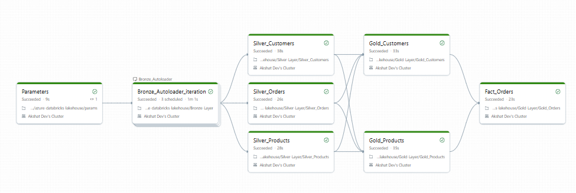

# 🚀 Azure Databricks Lakehouse with Star Schema & SCD Implementation

A **production-grade Azure Databricks Lakehouse project** demonstrating modern data engineering practices using **Unity Catalog, Medallion Architecture, Star Schema modeling, Structured Streaming**, and **Slowly Changing Dimensions (SCD)**.

🔗 **GitHub Repository:**  
👉 https://github.com/AkshatDev2002/azure-databricks-lakehouse-data-engineering

---

## 🧠 Project Overview

This project showcases the **design and implementation of an enterprise-scale Lakehouse architecture** on Azure Databricks.  
It focuses on **data governance, scalability, fault tolerance, and analytics-ready modeling**, closely aligned with real-world data engineering standards.

**Key highlights:**
- End-to-end **data ingestion → transformation → analytics**
- Governed data access using **Unity Catalog**
- Analytical modeling using **Star Schema**
- Historical data tracking using **SCD Type 1 & Type 2**

---

## 🏗️ Architecture

### 🔹 Medallion Architecture
Data is organized into layered zones to ensure quality, traceability, and scalability:

- 🟤 **Source** – Raw incoming data from ADLS Gen2  
- 🥉 **Bronze** – Raw ingested data using Structured Streaming (Auto Loader)  
- 🥈 **Silver** – Cleaned, enriched, and standardized datasets  
- 🥇 **Gold** – Analytics-ready fact and dimension tables  

---

## ⭐ Data Modeling – Star Schema

Designed a **Star Schema** to support high-performance analytical workloads:

### 📊 Fact Table
- `orders_fact`

### 📐 Dimension Tables
- `customers_dim`
- `products_dim`
- `regions_dim`

This structure enables efficient BI queries, aggregations, and reporting.

---

## ⚙️ Tech Stack

| Category | Tools |
|--------|-------|
| Cloud Platform | ☁️ Azure |
| Analytics Engine | ⚡ Azure Databricks |
| Storage | 🗄️ ADLS Gen2 |
| Governance | 🔐 Unity Catalog |
| Processing | 🔥 PySpark |
| Streaming | 🌊 Spark Structured Streaming (Auto Loader) |
| Storage Format | 📦 Delta Lake |
| Querying | 🧾 SQL |

---

## 📂 Notebook Breakdown

### 🥉 Bronze Layer
**Bronze_Layer.ipynb**
- Parameterized ingestion using `dbutils.widgets`
- Spark Auto Loader for incremental file ingestion
- Checkpointing for fault tolerance
- Exactly-once processing semantics

---

### 🥈 Silver Layer

**Silver_Customers.ipynb**
- Data cleansing and enrichment
- Email domain extraction
- Attribute derivation (full name)
- Delta persistence with Unity Catalog registration

**Silver_Orders.ipynb**
- Time-based analytics using window functions  
  (`dense_rank`, `rank`, `row_number`)
- Object-Oriented PySpark for reusable logic

**Silver_Products.ipynb**
- Custom SQL & Python UDFs
- Business rule implementation (discounts, brand normalization)

**Silver_Regions.ipynb**
- Cleaned reference data
- Delta table registration under Unity Catalog

---

### 🥇 Gold Layer

- ⭐ **Customers** → SCD Type 1 (current-state overwrite)
- ⭐ **Products** → SCD Type 2 (historical tracking)
- Analytics-ready datasets aligned with Star Schema

---

## 🔄 Slowly Changing Dimensions (SCD)

| Dimension | Type | Purpose |
|---------|------|---------|
| Customers | SCD Type 1 | Maintain latest customer state |
| Products | SCD Type 2 | Preserve historical changes |

---

## 🔐 Governance & Security

- Centralized metadata management using **Unity Catalog**
- Secure access via **Access Connector (Managed Identity)**
- Fine-grained RBAC on catalogs, schemas, and tables
- External locations mapped to ADLS containers

---

## 🖼️ End-to-End Pipeline Overview

Below are snapshots of the complete Azure Databricks Lakehouse pipeline, showcasing  
data ingestion, transformation, governance, and analytics layers.

### 🔹 End - To -End Pipeline

### 🔹 Pipeline Flow – High Level

---

## 📈 What This Project Demonstrates

- ✅ End-to-end ownership of a Databricks data platform  
- ✅ Real-world ingestion and transformation patterns  
- ✅ Strong analytics data modeling (Star Schema)  
- ✅ Enterprise governance and security practices  
- ✅ Interview-ready, production-aligned implementation  

---

## 👤 Author

**Akshat**  
Data Engineer | Azure Databricks | PySpark | Lakehouse Architect  

If you find this project useful, feel free to ⭐ the repository or connect!

